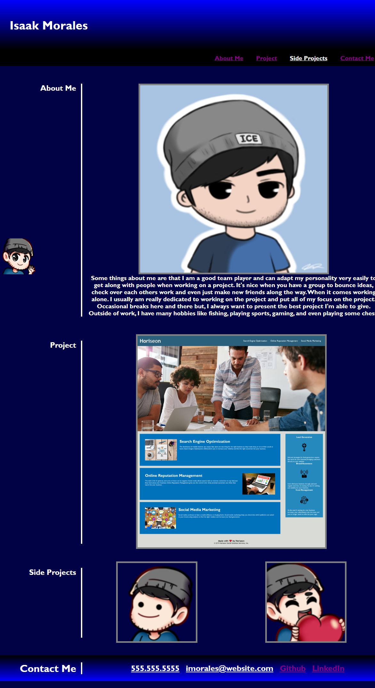

# Portfolio

## Description

My motivation for this project was to build my own portfolio using the knowledge I have in HTML and in CSS. I built this project to see my starting point in my new career and see what I can come up with later on once I'm more fluent in these languages and learn others! This doesn't really solve any problems but, in a sense it made me think of more solutions and try to solve them on my own or ask peers and research more about that specific topic. Once I solved it, I was able to incorporate it again but, this time with more ease. 

## Installation

This is a user friendly portfolio, meaning that all you would really have to do is just load the page and click the links that will send you to the corresponding link or title.

## Usage

1-Load up the website
2-Click any of the links provided
3-The links will send you to the corresponding site/page of the website
4-Finally, if you are to scroll all the way down, my contact information is provided with easy clickable links
5-Last minute addition I made was that if you click the little icon on the bottom left that follows you when you scroll, it will always navigate you to the top of the page.

## Credits

Kyle - https://github.com/kgiunta

Julian - https://github.com/julianr3

Dom - https://github.com/dev-dominick

## License

N/A

## Badges

N/A

## Features

N/A

## Tests

N/A